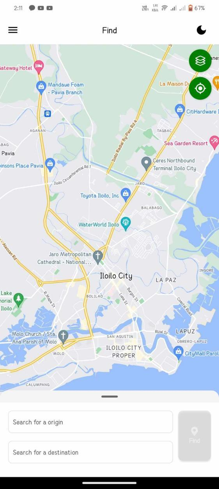
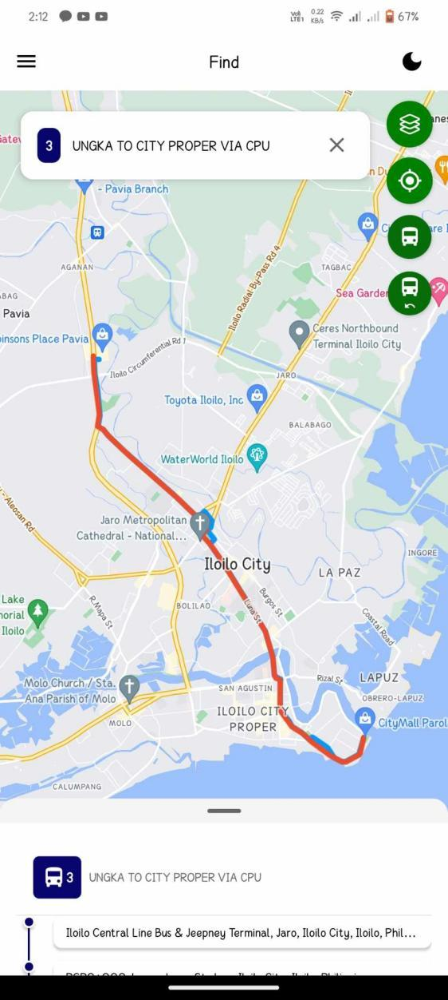
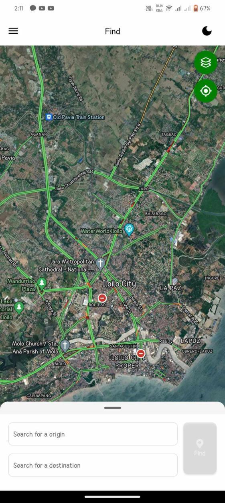
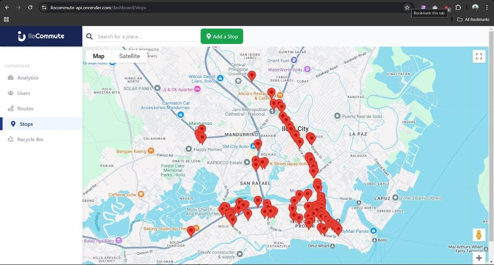
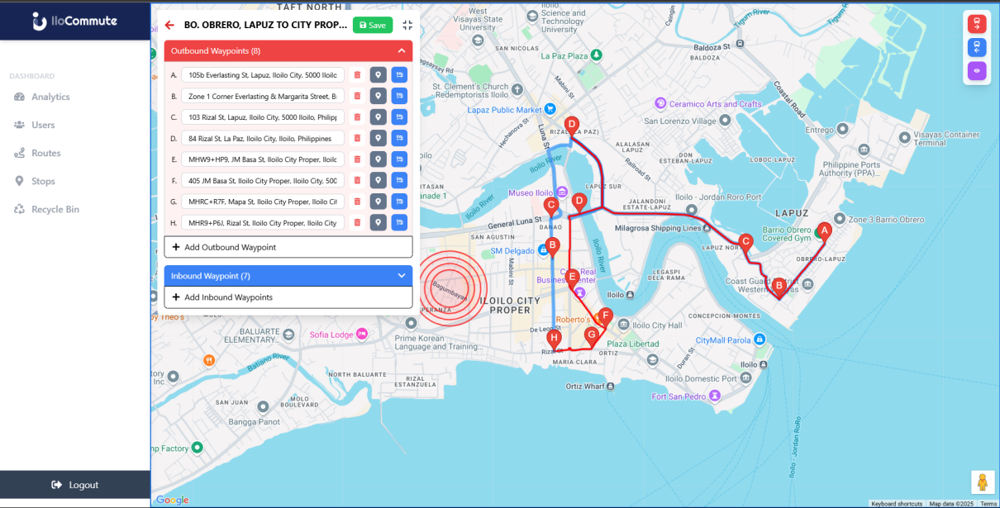

# IloCommute

IloCommute is a smart transportation platform focused on helping commuters in **Iloilo City** navigate public transportation more confidently and efficiently.

It combines:
- a **mobile app** for commuters, and
- a **web admin dashboard** for route and system management.

---

## Overview

IloCommute is built to solve common commuter problems such as:
- route confusion,
- fare uncertainty,
- discount visibility, and
- rerouting needs during events or traffic disruptions.

The platform is developed with adaptability in mind (RAD-oriented workflow), allowing the team to continuously improve the user experience using real commuter feedback and regularly updated route/fare data.

---

## Key Features

### Commuter Mobile App
- Search for origin and destination.
- View route suggestions and navigation paths.
- Check estimated fare details.
- Use GPS-assisted route guidance.
- Access map views for better location awareness.

### Administrator Dashboard
- Manage users and guests.
- Add and maintain routes, stops, and landmarks.
- Monitor dashboard analytics (e.g., users, guests, routes, stops).
- Support transport updates for changing city conditions and events.

---

## Project Structure

This repository currently includes:

- `IloCommute-2/` — **React Native + Expo** mobile application.
- `Ilocommute-frontend/` — **React + Vite** web/admin frontend.

---

## Tech Stack

### Mobile (`IloCommute-2`)
- Expo
- React Native
- TypeScript
- React Navigation / Expo Router
- Google Maps integration

### Web Admin (`Ilocommute-frontend`)
- React
- Vite
- Tailwind CSS
- ESLint

---

## Quick Start

### Prerequisites
- Node.js (LTS recommended)
- npm
- Expo CLI tooling (for mobile development)

### 1) Clone Repository

```bash
git clone <your-repository-url>
cd IloCommute
```

### 2) Run Web Admin Frontend

```bash
cd Ilocommute-frontend
npm install
npm run dev
```

### 3) Run Mobile App

```bash
cd IloCommute-2
npm install
npx expo start
```

---

## Screenshots

### Mobile App
<div align="center">
  
  
  
</div>

### Web Admin Dashboard
<div align="center">
  
  
</div>

---

## Vision

IloCommute contributes to the growing field of smart transportation by offering a scalable and practical model for developing urban centers. The platform aims to minimize commuter delays, reduce confusion in public transport use, and improve daily travel experiences for people in Iloilo City.

---

## Continuous Improvement

IloCommute follows an iterative improvement cycle:
1. Gather commuter/admin needs.
2. Maintain and update route and fare information.
3. Validate all core features.
4. Release and monitor usage.
5. Collect feedback and improve continuously.

---

## License

Add your preferred license here (e.g., MIT, Apache-2.0, proprietary).
